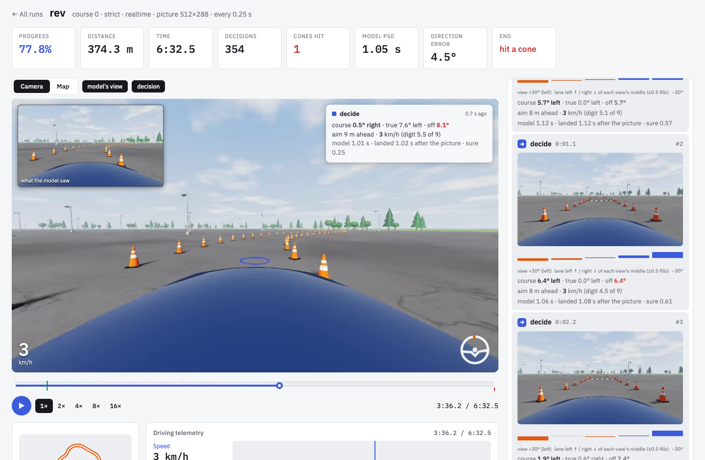

# revdrive

A one-token decision model drives a simulated car through a cone course from
what a camera sees. About once a second, [rev](https://github.com/54yyyu/rev)
asks a served vision model ten left-or-right questions about the camera view and
reads one token back from each; a controller drives to where the answers say the
course goes.

**[Results and replays →](https://54yyyu.github.io/revdrive)**



The setup follows [DrivingBench](https://drivingbench.com), which puts frontier
agents in a real car: the same camera mount, their cone density, their walking
pace, and the rule that a touched cone ends the run. revdrive asks what a model
that cannot reason, and answers in about a second, does with the same view.

## Results

| course | length · tightest bend | rev | oracle-point | blind |
|---|---|---:|---:|---:|
| 0 | 454 m · r 16 m | 78% | finished, 315 s | 0% |
| 1 | 440 m · r 12 m | 42% | finished, 304 s | 0% |
| 2 | 443 m · r 14 m | 7% | finished, 307 s | 0% |
| 3 | 444 m · r 14 m | 14% | finished, 307 s | 0% |
| 4 | 450 m · r 17 m | 6% | finished, 312 s | 0% |
| 5 | 452 m · r 13 m | 7% | finished, 313 s | 0% |
| 6 | 505 m · r 15 m | 5% | finished, 350 s | 0% |
| 7 | 462 m · r 14 m | 33% | finished, 320 s | 0% |
| 8 | 460 m · r 17 m | 30% | finished, 319 s | 0% |
| 9 | 456 m · r 13 m | 4% | finished, 316 s | 0% |
| 100 (after DrivingBench) | 132 m · r 8 m | 7% | finished, 90 s | 6% |
| **mean progress** | | **21.1%** | **100%** | **0.8%** |

`oracle-point` is the harness's ceiling: the course's true direction instead of
the model's, through the same controller, charged rev's one-second latency.
`blind` is rev shown grey pictures. Strict rules: the first cone touched ends
the run. One run per course.

What the numbers say, measured in [DECISIONS.md](DECISIONS.md):

- **The harness is not the limit.** With the true direction it finishes every
  course without touching a cone.
- **The model cannot see a tight corner from inside it.** At a 90° corner it
  says "left" with the same probability for every view and every mirror image;
  asked in chat, it answers "the course proceeds straight ahead". Every run ends
  in a bend (radius 9 to 35 m), seven of eleven within the first 14% of the
  course. On course 100, whose first 90° corner comes right after the start,
  rev gets no further than blind.
- **The question decides what can be read.** Asked how to turn the wheel, it
  steers away from the cones in front of it, the wrong way in a bend. Asked
  whether the lane's middle is left or right of the picture's, it reads the
  course's direction to 3.9° on average.
- **Less input reads better.** DrivingBench's full inputs (two cameras, a long
  task description, the wheel position) took that error from 3.9° to 6.6°.

## How rev drives

1. **Five views** from a camera at the top middle of the windshield: straight
   ahead and turned 15° and 30° each way, cut from the wide camera.
2. **Ten questions**, one per view and one per mirror image, all at once: is the
   middle of the lane about *d* m ahead left or right of the middle of the
   picture? One token each, read through rev's `Remote.read_tokens`.
3. **A direction.** Half the difference between each view and its mirror
   cancels any lean toward one side; a linear readout, fitted by
   `scripts/fit_head.py` on other courses, turns the five answers into the
   course's direction.
4. **A point on the ground**, fixed in the world where the picture was taken and
   far enough ahead to still be ahead when the answer lands.
5. **A controller.** Pure pursuit steers to the point; the model picks its own
   speed as a digit, 0 for stop to 9 for the ceiling.

## Run it

```bash
uv pip install git+https://github.com/54yyyu/revdrive

# the harness's ceiling: no model needed
revdrive run --policy oracle-point --courses 0-9,100 --latency 1.0

# the model: an sglang server serving a Qwen vision model
revdrive run --policy rev   --courses 0-9,100 --upstream http://HOST:PORT
revdrive run --policy blind --courses 0-9,100 --upstream http://HOST:PORT
revdrive summary

# watch it drive, replay any run, or drive it yourself with the arrow keys
revdrive ui --upstream http://HOST:PORT
```

The results here used Qwen3.8-27B (AWQ INT4) on sglang; rev's README has a
recipe for serving it. The cameras are drawn with OpenGL 4.1 through moderngl,
headless: a Mac, or Linux with a GPU or EGL. Runs append to
`results/runs.jsonl`, each with its full record in `results/runs/`, and a rerun
of the same experiment is skipped.

`revdrive run --help` lists the knobs: `--camera driver` for the driver's seat
instead of the windshield mount, `--cone-spacing 0` for sparser cones,
`--top-speed`, `--lenient` to count cones instead of stopping at the first,
`--mode lockstep` to make the world wait for every answer, `--latency` to
charge a fixed delay.

## The repository

| | |
|---|---|
| `src/revdrive/sim.py` | the courses and the car: a Corolla-sized bicycle model with steering-rate, pedal-lag and grip limits |
| `src/revdrive/render.py` | the cameras, drawn headless: asphalt, cones, shadows, trees, sky |
| `src/revdrive/point.py` | what the model is asked, and the controller that drives to its answers |
| `src/revdrive/runner.py` | one run of one policy on one course, and the record that replays it |
| `src/revdrive/web.py`, `ui.html` | the viewer: live runs, replays, driving yourself |
| `scripts/fit_head.py` | fits the readout from frames of other courses |
| `scripts/build_site.py` | the site: replays drawn from the saved records |
| `results/` | the published runs |
| `DECISIONS.md` | why it is this way: every choice measured, including what did not help |

Tests are scripts: `for t in tests/test_*.py; do python $t; done`.

## Not affiliated

revdrive is not affiliated with DrivingBench, comma.ai or Toyota; what it takes
from DrivingBench is listed in [THIRD-PARTY.md](THIRD-PARTY.md). It is a
simulator, with fewer cues that a corner is a corner than a real lot.

MIT license.
